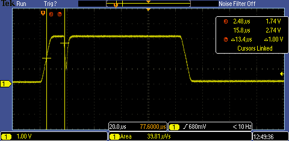

# end event

As per requirements, hit must not end until sampled value is below end threshold for a configurable amount of time.

Hit data was generated as usual:

    ./generate_hit.py --hit-max 3300 --hit-len 100 --hit-slope 500

This time, the file was edited to add a 6 zero samples from sample 66 to 71.

[data.txt](data.txt)

Data was captured with capture and hit-proc:

    ./capture  | ./hit-proc  -s2500 -e2300

And resulted in 2 hits (considering only channel 1):

    chan   1
    start  5.06588(s)
    end    5.0659(s)
    max    3.36874(v)
    len    12.5(us)
    integ  39.666(uVs)
    chan   1
    start  5.0659(s)
    end    5.06599(s)
    max    3.3724(v)
    len    86(us)
    integ  287.235(uVs)

With the hit-proc reconfigured to need a 10 sample timeout using the -l switch:

    ./capture  | ./hit-proc  -s2500 -e2300 -l10

Resulted in 1 hit:

    chan   1
    start  1.99203(s)
    end    1.99214(s)
    max    3.3724(v)
    len    103.5(us)
    integ  334.645(uVs)

