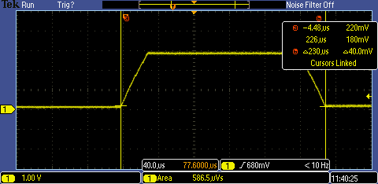
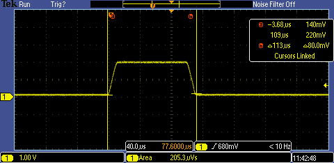
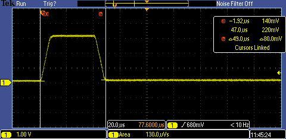

# integral testing

compliance test showed a problem with the integral value. 
This was fixed in the code and this tests it.

hit-proc arguments were adjusted to acount for zero offset and lowering threshold for hit start

    ./capture  | ./hit-proc  -s60 -e50 -0100 -1100

# test 1

./generate_hit.py --hit-max 3000 --hit-len 200 --hit-slope 100

captured value on channel 1:

    integ  581.364(uVs)

value from scope = 586.5uVs

# test 2

./generate_hit.py --hit-max 2000 --hit-len 100 --hit-slope 200

captured value on channel 1:

    198.351(uVs)

value from scope = 205.3uVs

# test 3

./generate_hit.py --hit-max 3300 --hit-len 40 --hit-slope 500

captured value on channel 1:

    128.905(uVs)

value from scope = 130.0uvS 

